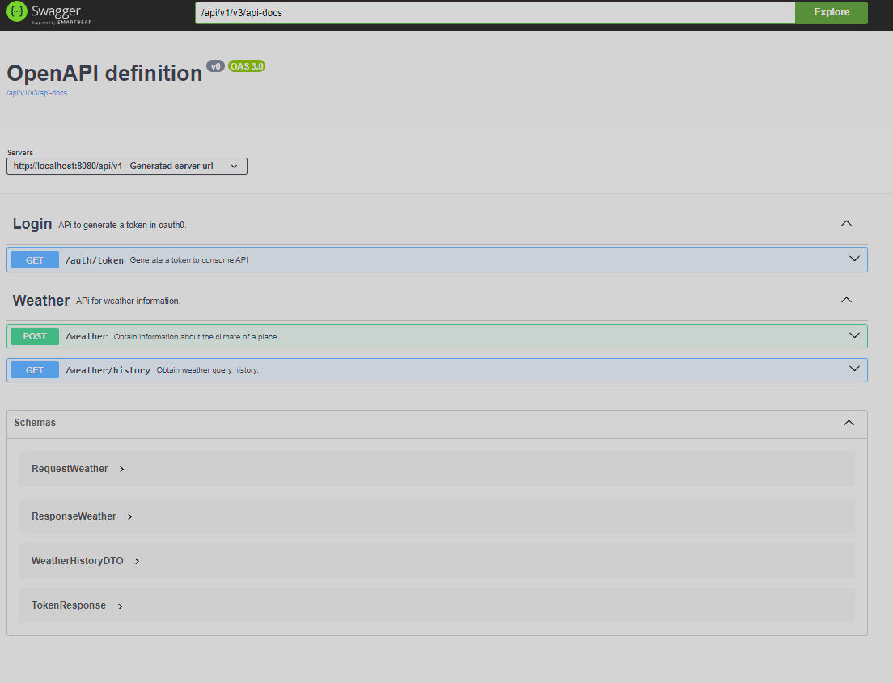
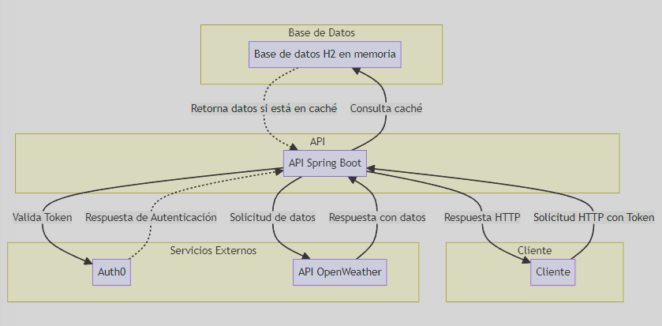
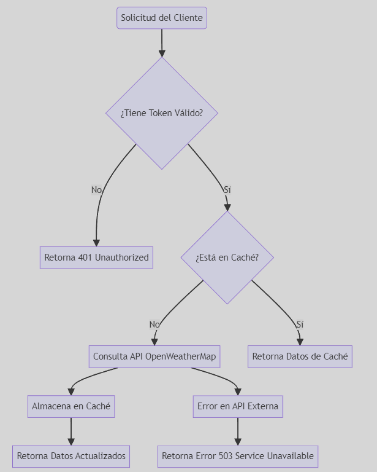

# Weather API

La Weather API es una aplicación Spring Boot diseñada para consultar las condiciones climáticas actuales basadas en una latitud y longitud específica, abstrayendo la implementación de un proveedor externo, OpenWeatherMap.org.

## Características

- Consulta condiciones climáticas actuales por latitud y longitud.
- Caché de respuestas para mejorar la eficiencia.
- Integración con OpenWeatherMap API.
- Autenticación de solicitudes a través de Auth0.

## Mejoras Propuestas

- Implementación de una caché distribuida (por ejemplo, Redis) para escalabilidad.
- Pruebas de carga para garantizar la estabilidad bajo demanda.
- Mejoras en la seguridad y gestión de secretos.
- Documentación completa de la API utilizando OpenAPI.

## Requisitos

- Java 17
- Gradle
- Docker
- Acceso a Kubernetes (por ejemplo, minikube o un cluster de AKS en Azure)

## Instalación y Ejecución

### Clonar el Repositorio

```bash
git clone https://github.com/jhonmvr/weather-api.git
```
```bash
cd weather-api
```
```bash
gradle build
```
```bash
java -jar target/weather-api-0.0.1-SNAPSHOT.jar
```
## Ejecución con Docker

Si prefieres ejecutar la aplicación usando Docker sin necesidad de clonar el repositorio y construir la imagen tú mismo, puedes hacerlo fácilmente siguiendo estos pasos:

### Paso 1: Obtener la Imagen de Docker

Primero, necesitarás obtener la imagen de la aplicación desde Docker Hub. Ejecuta el siguiente comando en tu terminal para descargar la imagen `jhonmvr/weather-api`:

```bash
docker pull jhonmvr/weather-api:latest
```
### Paso 2: Ejecutar la Imagen
Una vez descargada la imagen, puedes ejecutarla en tu máquina local. Este comando iniciará la aplicación en el puerto 8080:
```bash
docker run -d -p 8080:8080 jhonmvr/weather-api:latest
```
### Desplegar en Kubernetes
```bash
kubectl apply -f deployment.yaml
```
```bash
kubectl apply -f service.yaml
```
```bash
kubectl apply -f autoscale.yaml  # Si decides implementar el HPA
```

## Documentación de la API

La documentación interactiva de la API está disponible a través de Swagger UI. Puedes acceder a ella navegando a la siguiente URL después de iniciar la aplicación:

[Swagger UI](http://localhost:8080/api/v1/swagger-ui/index.html)

Este enlace te permitirá explorar los endpoints disponibles, probarlos directamente desde tu navegador y ver las respuestas de la API en tiempo real.



## Opcionales

### 1. Diagramas

#### Diagrama de Arquitectura



#### Diagrama de Flujo



### 2. Buenas Prácticas y Patrones Utilizados

- **Inversión de Control (IoC) y Inyección de Dependencias:** Utilizado para desacoplar la construcción de objetos y mejorar la testabilidad.
- **Patrón Repositorio:** Abstrae la lógica de acceso a los datos, permitiendo una mayor flexibilidad y mantenibilidad.
- **Model-View-Controller (MVC):** Estructura el código para separar la lógica de negocio, la interfaz de usuario y el control entre el modelo de datos y la vista.
- **Autenticación y Autorización:** Implementado utilizando OAuth2 con Auth0 para gestionar el acceso seguro a la API.

### 3. Recomendaciones para Despliegue en Ambientes Nube usando Microsoft Azure

- **Azure Kubernetes Service (AKS):** Para gestionar y orquestar contenedores de manera eficiente, escalable y segura.
- **Azure SQL Database:** Como alternativa escalable a la base de datos H2 en memoria para producción.
- **Azure Active Directory (AAD):** Para integrar la gestión de identidad y acceso en la nube con Auth0.
- **Azure Monitor y Application Insights:** Para monitoreo y telemetría avanzada de la aplicación.

### 4. Mejoras Propuestas

- **Implementación de Caché Distribuida:** Usar Redis para mejorar la gestión de la caché y la escalabilidad.
- **Pruebas de Estrés y Carga:** Asegurar la capacidad y la escalabilidad de la API bajo carga pesada.
- **Internacionalización y Localización:** Preparar la API para soportar múltiples idiomas y regiones.

### 5. Mejoras y Ajustes al Enunciado para Ambientes Empresariales

- **Clarificación de Requisitos No Funcionales:** Específicamente sobre escalabilidad, disponibilidad y seguridad.
- **Inclusión de Estrategias de Backup y Recuperación:** Crucial para garantizar la continuidad del negocio y la integridad de los datos.
- **Recomendaciones de Seguridad Mejoradas:** Incluir políticas de seguridad de red, cifrado en tránsito y en reposo, y gestión de secretos.
- **Consideraciones de Costos:** Incluir un análisis preliminar de costos para la implementación en Azure y recomendaciones para la optimización de costos.
